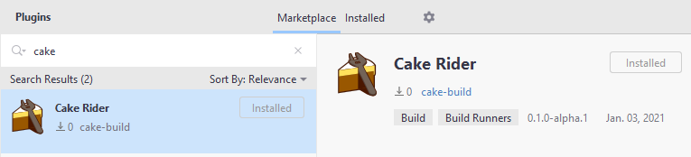
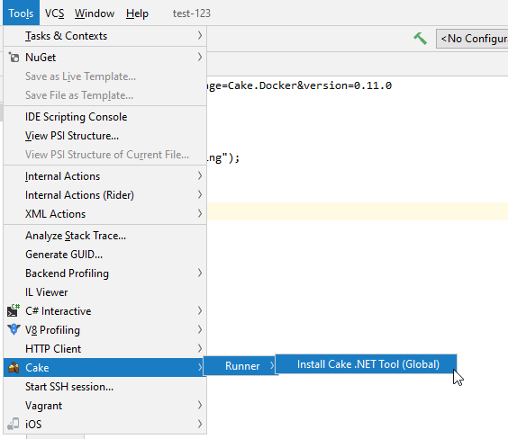
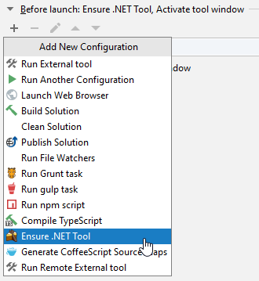

# Cake for Rider

Adds support for the [Cake](https://cakebuild.net/) build tool in Rider. 

## Install Cake

In order to use this extension, you must have
[Cake](https://cakebuild.net/) installed on your machine or in your solution.

Use [chocolatey](http://chocolatey.org/) to install it globally by
typing the following in an elevated command prompt:

>choco install -y cake.portable

## Install Cake for Rider

Go to File -> Settings -> Plugins -> Marketplace and search for *Cake for Rider*

### Release channels

JetBrains Marketplace has multiple channels for each plugin. Default is always the `Stable` channel,
however, Cake for Rider might make use of two other channels:

- **Beta**: The `beta` channel contains pre-releases.
- **Alpha**: The `alpha` channel contains unstable releases. Here be dragons!

To use one of the channels open the [plugin page in the JetBrains Marketplace](https://plugins.jetbrains.com/plugin/15729-cake-rider/)
select *Versions* and switch the channel on the left side of the page. Download the desired version and install it manually.

## Documentation

The full documentation of the latest release of Cake for Rider can be found at [https://cakebuild.net/](https://cakebuild.net/docs/integrations/editors/rider/)

### Documentation changes in the upcoming release

#### Cake .NET Tool install option
It is now possible to install (or update to) the current version of the Cake .NET Tool:

#### Ensure Cake .NET Tool BeforeRunAction
It is now possible to ensure Cake .NET Tool is installed using a before run action from in a run configuration:

## Discussion

If you have questions, search for an existing one, or create a new discussion on the Cake GitHub repository.

## Contribute

Check out the [Cake contribution guidelines](https://cakebuild.net/docs/contributing/contribution-guidelines)
if you want to contribute to this project.

## License

[MIT Licence](LICENSE.txt)