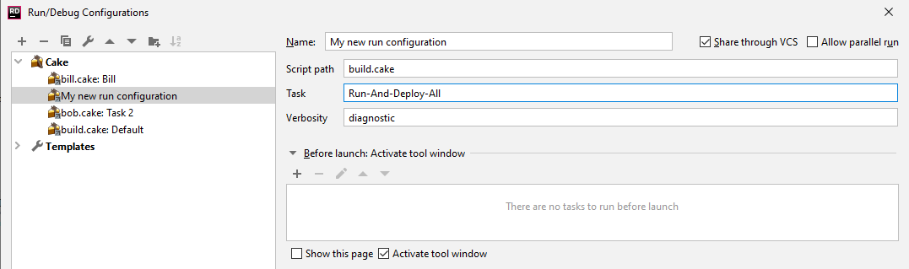

# Cake for Rider

Adds support for the [Cake](https://cakebuild.net/) build tool in Rider. 

## Install Cake

In order to use this extension, you must have
[Cake](https://cakebuild.net/) installed on your machine or in your solution.

Use [chocolatey](http://chocolatey.org/) to install it globally by
typing the following in an elevated command prompt:

>choco install -y cake.portable

## Install Cake for Rider

Go to File -> Settings -> Plugins -> Marketplace and search for *Cake Rider*

### Release channels

JetBrains Marketplace has multiple channels for each plugin. Default is always the `Stable` channel,
however, Cake for Rider might make use of two other channels:

- **Beta**: The `beta` channel contains pre-releases.
- **Alpha**: The `alpha` channel contains unstable releases. Here be dragons!

To use one of the channels open the [plugin page in the JetBrains Marketplace](https://plugins.jetbrains.com/plugin/15729-cake-rider/)
select *Versions* and switch the channel on the left side of the page. Download the desired version and install it manually.

## Build scripts tool window

Cake files in the project are automatically found by extension and their tasks are displayed in a tool window:

Here, a double click on the task will run the task immediately:

Alternatively, the buttons at the top of the tool window can be used to either run the task directly,
or create a new run configuration.

## Run configurations:

It is possible to have Cake tasks as run configurations:

The configurations can either be created from an existing Cake task, using the tool window or 
created manually using the run configuration editor:

## Settings

There are multiple configuration settings available under File -> Settings -> Build, Execution, Deployment -> Cake.

All settings are project - specific and stored in the `.idea` folder. To share settings between project members, make sure to include `CakeRider.xml` in your source control.

### Generic settings

* *Cake file extension*  
  This setting is used to find all Cake files and display them in the tool window.  
  Default: `cake`
* *Task Regex*  
  This regex is used to parse tasks from the Cake files.  
  Default: `Task\s*?\(\s*?"(.*?)"\s*?\)`
* *Verbosity*  
  This is the default verbosity to use, when running a task directly from the tool window or when creating a new run configuration.  
  Default: `normal`

### Runner settings

This window contains the runner to use when starting Cake. Additionally, a set of overrides can be added: Here, a regular expression is matched against the system property `os.name` and, if it matches, the runner is overridden.

Default value is `dotnet-cake` and default override is `dotnet-cake.exe` for the regex `^.*windows.*$`. This default requires the [Cake .NET tool](https://cakebuild.net/docs/running-builds/runners/dotnet-tool) being globally installed.

## Contribute

Check out the [Cake contribution guidelines](https://cakebuild.net/docs/contributing/contribution-guidelines)
if you want to contribute to this project.

## License

[MIT Licence](LICENSE.txt)